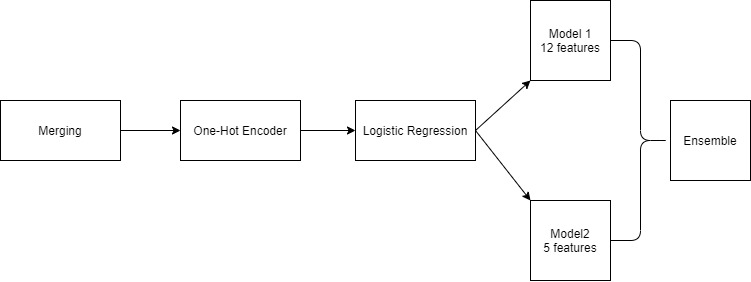

# CTR Prediction for Push Notification and Advertisement


This repository contains a Jupyter notebook documenting our research and development process in the task of Click-Through Rate (CTR) prediction for push notifications and advertisements. The notebook provides a comprehensive overview of the steps involved, starting with our most successful results, followed by our unsuccessful attempts.

## Structure of the Project

The Jupyter notebook in this repository is organized into the following sections:

 


1. **Preprocessing:**
   This section is all about cleaning and transforming the raw data into a suitable format that can be fed into a machine learning model.
   
   - **Timestamp:** The timestamps are shifted by the first timestamp, then modulo 24 is taken to convert them into hours. These hours are then categorized into four segments of the day (0-6, 6-12, 12-18, 18-24).
   
   - **Page Topic:** The project considers only the topicId with the maximum confidence value for each pageId, ignoring the rest. This choice is based on the observation that there are too many pageTopics with low confidence.
   
   - **Merging Data:** All the different data sources (`event.csv`, `page.csv`, `page_topic.csv`, `ad.csv`, and `click_train.csv` or `click_test.csv`) are merged based on common identifiers.
   
   - **One-Hot Encoding:** Since machine learning models cannot process categorical data directly, these categorical values need to be converted into a numerical format. This is done using One-Hot Encoding, where each category is represented as a binary vector.
   
2. **Modeling:**
   After preprocessing, the data is then used to train a machine learning model, which in this case is Logistic Regression. There are two distinct models trained on different subsets of the features.
   
   - **Splitting Data:** The data is split into training and testing sets. The splitting is done twice, creating two different sets of train-test data, which are used to train two separate logistic regression models. There's also a balance handling due to the class imbalance problem.
   
   - **Logistic Regression:** Two logistic regression models are trained on the prepared data. The models are tuned to balance the class weights because there's a significant class imbalance in the data. The 'C' parameter, which controls the regularization strength, is set to 0.72 for both models after tuning.
   
3. **Submission:**
   After the models are trained, they are used to predict the probabilities of clicks on the test data. These probabilities are then used to rank the ads for each displayId. The ranking is based on the sum of the predicted probabilities from the two trained logistic regression models. The ranked results are then prepared for submission. 

This project combines various data processing steps, machine learning techniques, and the concept of ensemble learning (using multiple models for prediction) to tackle the problem of predicting click-through rates for advertisements.**Unsuccessful attempts**
    - Bayesian Probability Method with joint pairwise probability
    - Label Smoothing
    - Factorization Machine
    - Wide and Deep

## Dataset

The dataset we worked on includes the following files:

- `ad.csv`
- `event.csv`
- `page.csv`
- `page_topic.csv`
- `click_train.csv`
- `click_test.csv`

All files are available in the `datadays2020_contest_public_dataset` directory.

## Other Methods Used

1. **Bayesian Probablity Method with joint pair wise probability:**

   This is an attempt to use Bayesian probability, a branch of probability that deals with the concept of uncertainty, to generate features. It pairs up different 'anchor' variables (like 'adId', 'campaignId', 'advertiserId') with other features (like 'pageId', 'userId', etc.), and then creates a new dataframe that represents the mean clicked ratio for each pair. The new dataframe is then used to train a random forest model.

2. **Label Smoothing:**

   Label smoothing is a regularization technique that introduces noise for the labels, turning a hard classification problem into a softer regression problem. This is known to improve model performance and make it more robust to small changes in input data. This is achieved by adding 1 to the clicked value, and dividing it by twice the frequency of each 'displayId'. 
     - Szegedy, Christian, et al. "Rethinking the Inception Architecture for Computer Vision." arXiv preprint arXiv:1512.00567 (2015). [Link](https://arxiv.org/abs/1512.00567)

3. **Factorization Machine:**

   Factorization Machines (FM) are a model class that combines the advantages of Support Vector Machines (SVM) with factorization models. They can estimate interactions even in problems with huge sparsity. This code implements a Factorization Machine using PyTorch, which takes in sparse data and predicts binary classification results. 
  - Rendle, Steffen. "Factorization machines." 2010 IEEE International Conference on Data Mining. IEEE, 2010. [Link](https://www.csie.ntu.edu.tw/~b97053/paper/Rendle2010FM.pdf)
   - Juan, Yuchin, et al. "Field-aware factorization machines for CTR prediction." Proceedings of the 10th ACM Conference on Recommender Systems. 2016. [Link](https://www.csie.ntu.edu.tw/~cjlin/papers/ffm.pdf)

4. **TensorFlow Factorization Machine:**

   This attempt uses a TensorFlow implementation of Factorization Machine (tffm), where the model's order, rank, epochs, batch size and other parameters are specified. This model is then trained on the data, and accuracy is calculated for both the training and test sets.

5. **Wide and Deep Model:**

   Wide & Deep learning is a model architecture that jointly trains a wide linear model and a deep neural network, combining the benefits of both memorization and generalization. The Wide part of the model (linear model) is fed directly into the final output layer, while the Deep part (DNN model) is fed into the output layer through several hidden layers. The final layer concatenates the output of the Wide and Deep parts and then feeds it into a sigmoid activation function. 
   - Cheng, Heng-Tze, et al. "Wide & deep learning for recommender systems." Proceedings of the 1st workshop on deep learning for recommender systems. 2016. [Link](https://arxiv.org/abs/1606.07792)

These are various methods attempted to improve the model's performance on the click prediction problem. Each of these attempts has its own strengths and weaknesses, and the choice of method depends on the specific problem and the available data.

## Usage

Clone the repository to your local machine:

```bash
git clone https://github.com/yourusername/CTR-Prediction.git
```

Navigate to the directory:

```bash
cd CTR-Prediction
cd report
```

Install the required packages:

```bash
pip install -r requirements.txt
```

Now you can run the notebook in a Jupyter notebook environment:

```bash
jupyter notebook
```

Select the notebook you want to run in the opened browser.

## Contributions

Contributions are always welcome. Please read the contribution guidelines first.
